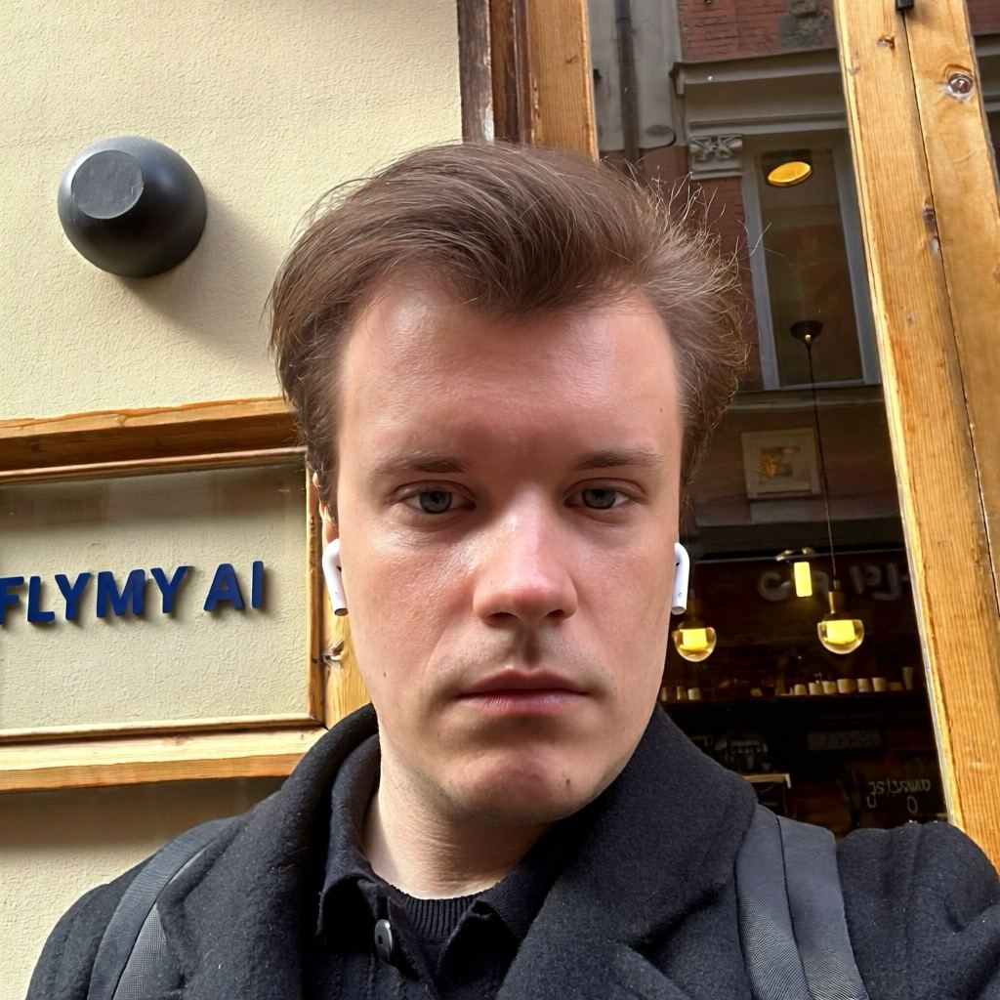

# LoRA Training for Qwen-Image


An open-source implementation for training LoRA (Low-Rank Adaptation) layers for Qwen/Qwen-Image models by [FlyMy.AI](https://flymy.ai).

<p align="center">
  
</p>

## 🌟 About FlyMy.AI

Agentic Infra for GenAI. FlyMy.AI is a B2B infrastructure for building and running GenAI Media agents.


**🔗 Useful Links:**
- 🌐 [Official Website](https://flymy.ai)
- 📚 [Documentation](https://docs.flymy.ai/intro)
- 💬 [Discord Community](https://discord.com/invite/t6hPBpSebw)
- 🐦 [X (Twitter)](https://x.com/flymyai)
- 💼 [LinkedIn](https://linkedin.com/company/flymyai)
- 📺 [YouTube](https://youtube.com/@flymyai)
- 📸 [Instagram](https://www.instagram.com/flymy_ai)

## 🚀 Features

- LoRA-based fine-tuning for efficient training
- Compatible with Hugging Face `diffusers`
- Easy configuration via YAML
- Open-source implementation for LoRA training

## ⚠️ Project Status

**🚧 Under Development:** We are actively working on improving the code and adding test coverage. The project is in the refinement stage but ready for use.

**📋 Development Plans:**
- ✅ Basic code is working
- ✅ Training functionality implemented
- 🔄 Performance optimization in progress
- 🔜 Test coverage coming soon

---

## 📦 Installation

1. Clone the repository and navigate into it:
   ```bash
   git clone https://github.com/FlyMyAI/qwen-image-lora-trainer
   cd qwen-image-lora-trainer
   ```

2. Install required packages:
   ```bash
   pip install -r requirements.txt
   ```

3. Install the latest `diffusers` from GitHub:
   ```bash
   pip install git+https://github.com/huggingface/diffusers
   ```

---

## 🏁 Start Training

To begin training with your configuration file (e.g., `train_lora.yaml`), run:

```bash
accelerate launch train.py --config ./train_configs/train_lora.yaml
```

Make sure `train_lora.yaml` is correctly set up with paths to your dataset, model, output directory, and other parameters.
## 🧪 Usage

---
### 🔧 Initialization

```python
from diffusers import DiffusionPipeline
import torch

model_name = "Qwen/Qwen-Image"

# Load the pipeline
if torch.cuda.is_available():
    torch_dtype = torch.bfloat16
    device = "cuda"
else:
    torch_dtype = torch.float32
    device = "cpu"

pipe = DiffusionPipeline.from_pretrained(model_name, torch_dtype=torch_dtype)
pipe = pipe.to(device)
```

### 🔌 Load LoRA Weights

```python
# Load LoRA weights
pipe.load_lora_weights('pytorch_lora_weights.safetensors', adapter_name="lora")
```

### 🎨 Generate Image with lora trained on person

```python
prompt = '''Valentin in a natural daylight selfie at a cafe entrance. He looks seriously into the camera, wearing a black coat or jacket and wireless earbud. Background includes wooden frames, warm pendant lights, and urban cafe details. With text "FLYMY AI"'''
negative_prompt =  " "
image = pipe(
    prompt=prompt,
    negative_prompt=negative_prompt,
    width=1024,
    height=1024,
    num_inference_steps=50,
    true_cfg_scale=5,
    generator=torch.Generator(device="cuda").manual_seed(346346)
)

# Display the image (in Jupyter or save to file)
image.show()
# or
image.save("output.png")
```

### 🖼️ Sample Output




## 🤝 Support

If you have questions or suggestions, join our community:
- 🌐 [FlyMy.AI](https://flymy.ai)
- 💬 [Discord Community](https://discord.com/invite/t6hPBpSebw)
- 🐦 [Follow us on X](https://x.com/flymyai)
- 💼 [Connect on LinkedIn](https://linkedin.com/company/flymyai)
- 📧 [Support](mailto:support@flymy.ai)

**⭐ Don't forget to star the repository if you like it!**
